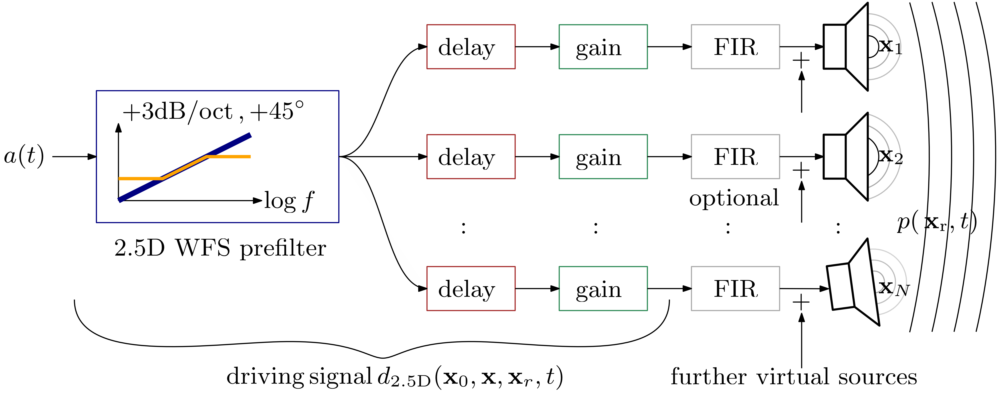
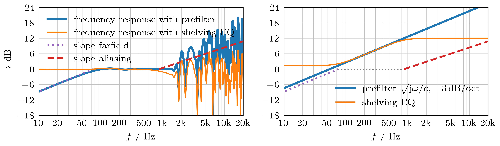
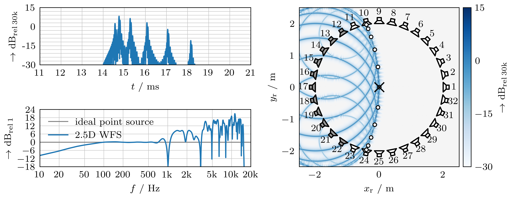
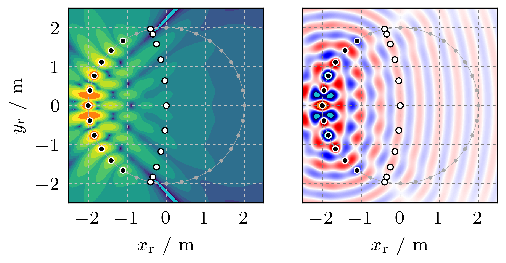
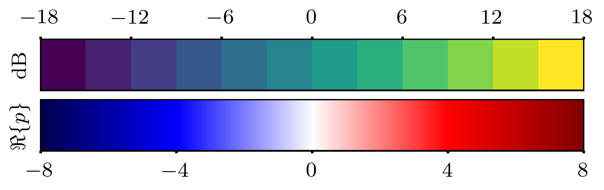

# Wave Field Synthesis
- Repository https://github.com/spatialaudio/wfs_chapter_hda
- Authors' versions for the chapters (English, German) on **Wave Field Synthesis** in
  - Stefan Weinzierl (editor): *Handbuch der Audiotechnik*, 2nd GER edition, Springer, 2025
  - Stefan Weinzierl (editor): *Handbook of Audio Technology*, 1st ENG edition, Springer, TBA
  - https://link.springer.com/book/10.1007/978-3-662-60369-7

## Abstract
Wave field synthesis (WFS) is a spatial reproduction technique.
It involves controlled interference to produce spatially and temporally distinct wavefronts.
This requires loudspeaker arrays with very dense loudspeaker spacing and individual signal processing for each loudspeaker. 
Unlike channel-based reproduction methods, WFS calculates the loudspeaker signals using measurement data or audio objects and their spatio-temporal parameters.
WFS is used in loudspeaker-based auralisation, reverberation enhancement, 3D sound reinforcement, audiological research and spatialised audio arts.

## Essence of WFS in Graphics

*2.5D WFS signal flow for rendering a virtual source with its audio signal a(t) towards the sound pressure field p(x,t).*

*2.5D WFS prefiltering.*

*2.5D WFS of a virtual point source: acoustic impulse response (left, top), acoustic transfer function (left, bottom) at probe point (x=0, y=0); and wave front snapshot (right) due to excitation with a 15kHz-low-pass filtered impulse.*

*2.5D WFS of a virtual point source. Single-frequency soundfield: level (left), snap shot of instantaneous sound pressure (right). Colors as indicated below.*

## Rendered PDF Files of the Chapter
  - [author's German version that was submitted to publisher](latex/Schultz_2023_WFS_Chapter_Weinzierl_HdA2nd_IEEE_DEU_b615499.pdf)
  - [author's English version that was submitted to publisher](latex/Schultz_2025_WFS_Chapter_Weinzierl_HdA2nd_IEEE_ENG_db56c01.pdf)

## Zenodo Versions / Snapshots of the Repository with DOI
  - https://doi.org/10.5281/zenodo.8060879 (author's German version that was submitted to publisher)
  - https://doi.org/10.5281/zenodo.17560617 (author's English version that was submitted to publisher)
  can be cited as: Schultz, F., Hahn, N., & Spors, S. (2025). Wave Field Synthesis (v0.4). Zenodo. https://doi.org/10.5281/zenodo.17560617

## Licenses
  - text and graphics under [CC BY 4.0 license](https://creativecommons.org/licenses/by/4.0/)
  - source code under [MIT license](https://opensource.org/licenses/MIT)
  - publisher Springer has copyright to their finally edited and authors' approved English / German chapters and their layouts
  - we use the violine image from https://upload.wikimedia.org/wikipedia/commons/thumb/f/f1/Violin.svg/2048px-Violin.svg.png
  to create the files `python/violin_wfs_ENG.png` and `python/violin_wfs_DEU.png`
  - we use the photo `fotos/WFS_Array_UniRostockH8_2014.jpg` CC BY 4.0 Matthias Geier & Sascha Spors
  - all other graphics (as pdf, png, eps, svn, ipe) in this repository are CC BY 4.0 Frank Schultz & Nara Hahn
## Reference Implementation of the Simulations
  - the reference implementation uses and is double checked against the [sfs](https://github.com/sfstoolbox/sfs-python/releases/tag/0.6.3) toolbox (>= 0.6.3)
  - Python environment install is straightforward with `uv sync`  using the provided `pyproject.toml`
## Recommended Additional Resources
  - [The complete basics of wave field synthesis in a nutshell](https://git.iem.at/zotter/wfs-basics)
  - [Jupyter notebook on 2.5D WFS referencing scheme examples](https://sfs-python.readthedocs.io/en/latest/examples/wfs-referencing.html)
## Authors
  - Frank Schultz, https://orcid.org/0000-0002-3010-0294, https://github.com/fs446
  - Nara Hahn, https://orcid.org/0000-0003-3564-5864, https://github.com/narahahn
  - Sascha Spors, https://orcid.org/0000-0001-7225-9992, https://github.com/spors
